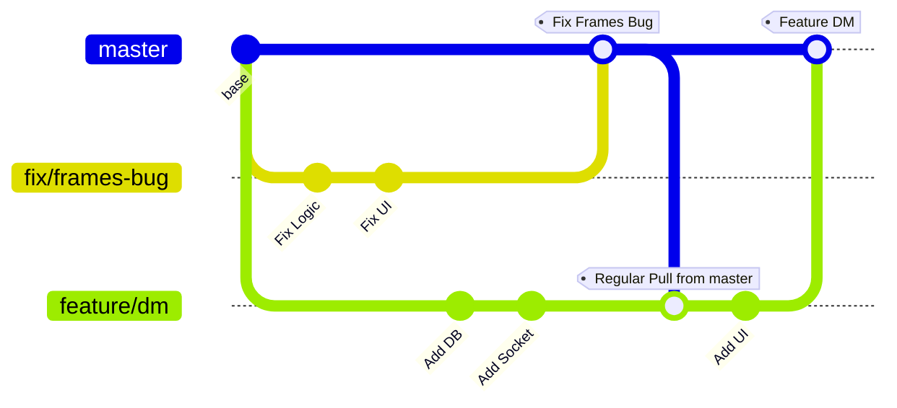
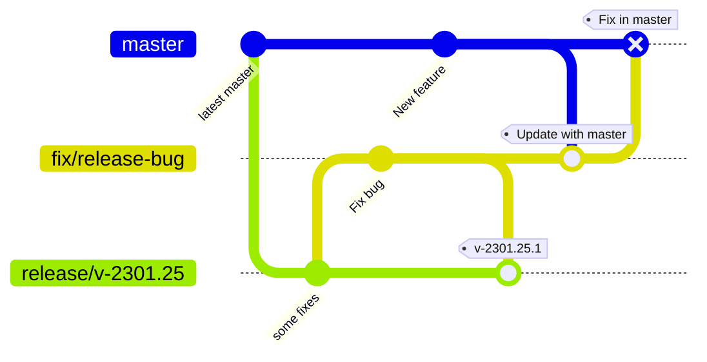
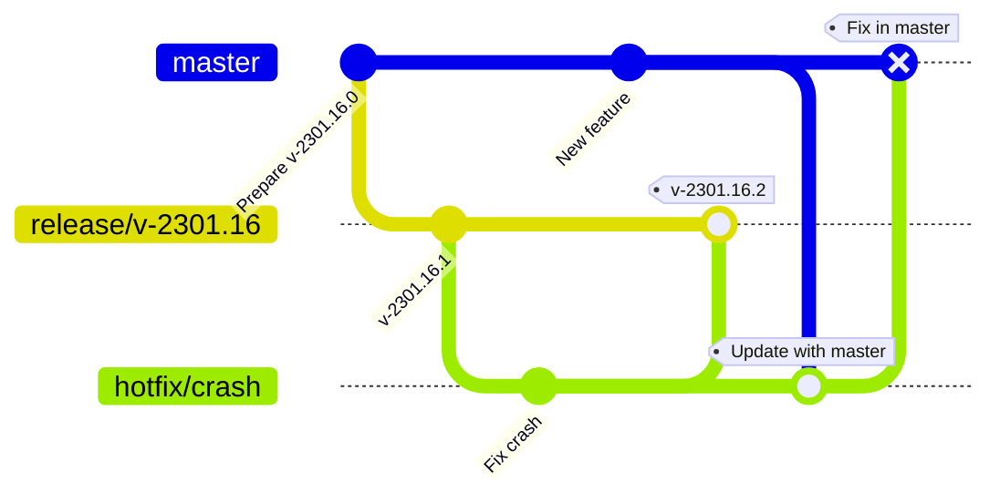

# App Branching Strategy

## Permanent Trunks
* `master` -> Latest and greatest Dev Tested Code
No other permanent trunks.

> All PRs will be Squashed and Merged

## Other branches that come and go
* `feature/<feature_name>`
* `fix/<bug_title>`
* `release/v-<version.major>.<version.minor>` 
	* Temporary branch that lives while a release is being _prepared_
	* No patch number in branch name because patch number is subject to change as fixes are merged after Testing
* `backmerge/<pr_number>`
	* Used to raise PRs to master for every change pushed to release branches

## Feature Development and Bug Fixing

## Versioning Schema
`YYMM.DD.N`
`N` -> patch number

Yes. It's a date based versioning scheme that is 
* compatible with semver comparisons
* compatible with string alphabetical order comparisons ( `2301.16.0` > `2212.31.10` )
* and avoids the question - "When did we release this version" forever from anyone in the team

## App Release and Release Fixes
### Release Preparation
1. Cut the release branch from latest `master`
1. Generate Artifact(APK / IPA), and Dev Test
1. Distribute Artifact internally
1. Fix bugs in release branch, `master` branch and go to Step 2
1. Once we are 🟢 on all tests, Tag the latest commit from the release branch and upload the Artifact to App Stores

### Hotfix
Fixing an issue in current production build (`v-2301.16.1`)
1. Create a branch from the release tag (tag: `v-2301.16.1` -> branch: `release/v-2301.16`)
1. Fix the issue and raise PRs to release branch and master as shown below
1. Distribute Artifact Internally
1. Once we are 🟢 on all tests, Tag the latest commit from the release branch and upload the Artifact to App Stores

> Note: The second PR from `hotfix` branch to `master` will be automated

## Automated Workflows
### Update Full Version on `master`
`.github/workflows/update_version_on_master_change`

On every merge to master we update the full version. Major, minor versions will be modified if the existing version is of a previous date, otherwise only the patch number will be increased.

**Example**:  
Existing Version: `2301.25.2`
If a new commit is pushed on 25th Jan, 2023, the version becomes `2301.25.3`
If a new commit is pushed on 26th Jan, 2023, the version becomes `2301.26.0`

### Update Patch Number on `release*`
On every commit we update the patch number on `release*` branches

### Backmerge pushes into `release*` onto `master`
Every push to `release*` will trigger a corresponding PR to `master` via a `backmerge/<pr_number>` branch

