# Branching Strategy for Mobile Apps

[Understand The Why s 🤔](#the-why-s-)

## Repository Settings ⚙️
* [Only allow Squash Merges](https://egghead.io/lessons/github-automatically-squash-commits-on-github-when-merging-pull-requests)
* ✅ Delete head branches once pull request is merged
* Settings > Actions > Workflow Permissions
	* Read and write permissions
	* Allow GitHub Actions to create and approve pull requests

## Permanent Trunks 🛤️
* `master` -> Latest and greatest Dev Tested Code

No other permanent trunks.

## Other branches that come and go ⏳
* `feature/<feature_name>`
* `fix/<bug_title>`
* `release/v-<version.major>.<version.minor>` 
	* Temporary branch that lives while a release is being _prepared_
	* No patch number in branch name because patch number is subject to change as fixes are merged after Testing
* `auto-backmerge/<pr_number>` Used to raise PRs to master for every change pushed to release branches

## Versioning Scheme 🏷️
`YYMM.DD.N`

`N` ➡️ patch number

Ex: `2301.25.0`, `2302.01.4`

## Automated Workflows 🤖
### On PR merge to `master`
🤖 [on-merge-master.yml](./.github/workflows/on-merge-master.yml)
On every merge to master we update the full version. Major, minor versions will be modified if the existing version is of a previous date, otherwise only the patch number will be increased.

**Example**:  
Existing Version: `2301.25.2`  
If a new commit is pushed on 25th Jan, 2023, the version becomes `2301.25.3`  
If a new commit is pushed on 26th Jan, 2023, the version becomes `2301.26.0`  

### On PR merge to `release/**`
🤖 [on-merge-release.yml](./.github/workflows/on-merge-release.yml)
#### Update Patch Number on `release*`
On every commit we update the patch number on `release*` branches

#### Backmerge pushes into `release/**` onto `master`
🤖 [on-merge-release.yml](./.github/workflows/on-merge-release.yml)
Every push to `release*` will trigger a corresponding PR to `master` via a `auto-backmerge/<pr_number>` branch. 

> The PR will be automatically merged if there are no conflicts

## Manually triggered workflows 🔲
### Prepare a new release
🤖 [prepare-a-release.yml](./.github/workflows/prepare-a-release.yml)
Create a release branch from latest master, with the right version in the branch name.

Actions ▶️ > Prepare a release > Run workflow

### Tag Release
🤖 [create-tagged-release.yml](./.github/workflows/create-tagged-release.yml)
Tag the latest commit in a release branch with the right version tag and release notes

Actions ▶️ > Create Tagged Release > Run workflow (select the release branch)

## Feature  Development⭐ & Bug Fixing🪲

```mermaid
%%{init: { 'gitGraph': {'mainBranchName': 'master', 'showCommitLabel': true}} }%%

gitGraph
	commit id: "🤖 2301.25.0"
	branch fix/frames-bug
	commit id: "Fix Logic"
	commit id: "Fix UI"
	checkout master
	branch feature/dm
	commit id: "Add DB"
	commit id: "Add Socket"
	checkout master
	merge fix/frames-bug id: "PR: Frames Bug"
	commit id: "🤖 2301.25.1"
	checkout feature/dm
	merge master id: "Pull master"
	commit id: "Add UI"
	checkout master
	merge feature/dm id: "PR: Feature DM"
	commit id: "🤖 2301.25.2"
```

## Releases ⛳
### Preparation ⚒️
1. Cut the release branch from latest `master` ( Actions ▶️ > Prepare a release > Run Workflow )
1. Generate Artifact(APK / IPA), and Dev Test
1. Distribute Artifact for testing
1. Fix bugs in release branch, `master` branch and go to Step 2

### Making the release 🏌️
Actions ▶️ > Create Tagged Release > Run Workflow (select release branch)

Once we are 🟢 on all tests, do the above to tag the latest commit from the release branch and create a Github release with automated release notes. And upload the artifacts to the App Stores

### Hotfix 🧯
Fixing an issue in current production build (`v-2301.16.1`)
1. Create a branch from the release tag (tag: `v-2301.16.1` -> branch: `release/v-2301.16`)

The rest is same as normal release flow

# The Why s 🤔
## Why only squash merging?
Linear history is desirable for various reasons. All boil down to simplicity again.

Only allowing squash merging with a single trunk is the simplest way to achieve linear history. No one has to think, the right thing happens automatically.

Also in general, people have better discipline with respect to PR titles than commit messages, so your change-logs also look good.

## Why have release branches at all?
Unlike server apps, mobile app release processes tend to be long. It's common to take **2 or more weeks** if we include the gradual roll out to 10% > 20% > 50% > 100% while observing stability and metrics along the way.

Meanwhile, contributors should **NOT** have ambiguity of whether it is safe to merge to master right now. 

Once the release is made and the commit is tagged, they don't have any purpose. That's why we delete them after release.

```mermaid
gantt
	title App development and releases
	dateFormat YYYY-MM-DD
	tickInterval 3day

	section Dev 1
	Feature 2 ⭐ :a, 2022-01-13, 15d
	Merge to master: crit, milestone, after a, 0d

	section Dev 2
	Feature 1 ⭐ :b, 2022-01-12, 2d
	Merge to master: milestone, after b, 0d
	Library Upgrade ⬆️ : l, 2022-01-16, 1d
	Merge to master :crit, milestone, after l, 0d
	Fix Feature 1 🪲: b2, after r1, 2d
	Merge to release: milestone, after b2, 0d
	Framework Upgrade ⬆️ : f, 2022-01-22, 1d
	Merge to master :crit, milestone, after f, 0d

	section Release
	Prepare Release 2201.14: milestone, after b, 0d
	Testing Feature 1 ⭐: r1, after b, 4d
	Testing Feature 1 ⭐: r2, after b2, 1d
	Rollout 2201.14.1 10% - 100%: r3, after r2, 7d
	Prepare Release 2201.31: milestone, 2022-01-31, 0d
	
```

> Merging to master 🟥 is safe and encouraged even when a release is ongoing

## Why use a date based versioning scheme?
It's a date based versioning scheme that is also
* compatible with `semver` comparisons for which version is greater than the other
* compatible with string alphabetical order comparisons ( `2301.16.0` > `2212.31.7` )

And best of all avoids the question - **When did we release this version?** forever, from anyone in the whole team

Even if answering the above question is not that important for your team, it's equally good, if not better than `semver`. Which, most teams use by default. Semantic Versioning (`semver`) makes sense for libraries. Consumers of your library want to know when there are breaking changes and when there aren't. And package managers take advantage of this convention to safely upgrade dependencies. Mobile App Users / App Stores have no such expectations from App Versions. They barely care.

My teams have been using date based versioning schemes for more than a year and it's great!
